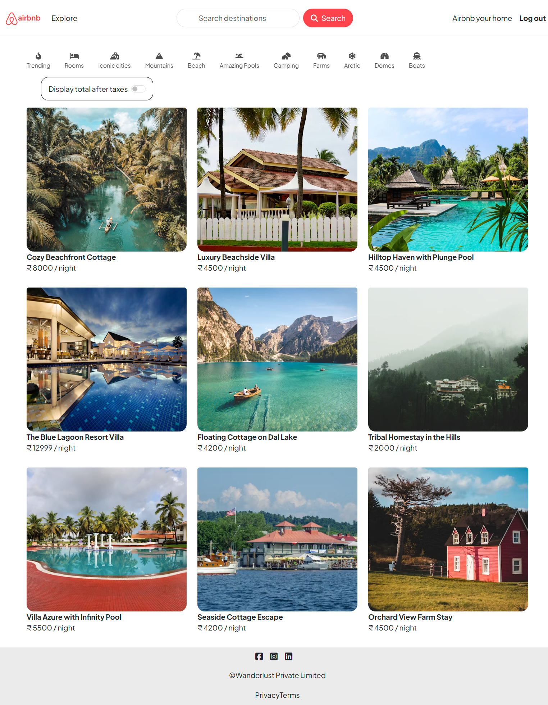
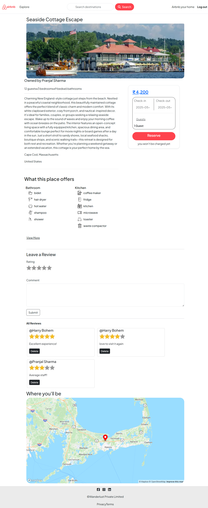
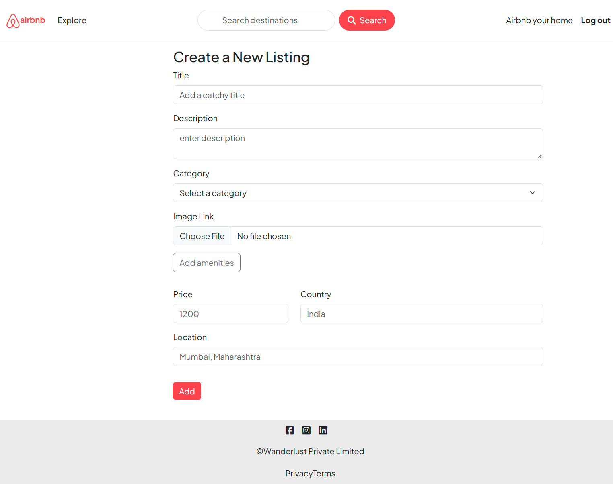

# 🚀 Airbnb Clone 🏠💻


A full-stack clone of the Airbnb platform built using Node.js, Express, MongoDB, and **EJS** templating to replicate its core features and provide a seamless user experience.

---

📖 Description

The Airbnb Clone project is a full-stack web application built using Node.js, Express, MongoDB, and **EJS** templating. It replicates the core functionalities of the Airbnb platform — including user authentication, listing management, reviews, and filtering — with a clean, responsive, and intuitive interface.

This project showcases server-side rendering using **EJS**, combined with Express.js backend logic and MongoDB. It integrates Passport.js for authentication and Cloudinary for image storage, offering a production-ready structure for scalable apps.

The Airbnb Clone demonstrates **MVC** architecture, routing, middleware handling, and secure authentication.

✨ Features

User Authentication – Secure login and registration using Passport.js

Listing Management – Create, view, edit, and delete property listings

Reviews System – Add and manage user reviews with ratings and comments

Image Upload – Upload and manage images using Cloudinary

Filtering & Categories – Filter listings based on amenities, price, or category

Error Handling – Centralized error handling using custom middleware and ExpressError

Responsive UI – Dynamic and responsive **EJS** templates with modular includes and layouts

Data Validation – Ensures consistent and valid user input using schema-based validation

🧰 Tech Stack
Technology	Description
Templating Engine	**EJS**
Backend	Node.js + Express.js
Database	MongoDB (Mongoose **ORM**)
Authentication	Passport.js
Image Upload	Cloudinary
Validation	Schema-based validation (schema.js)
Styling	Custom **CSS**
Error Handling	Custom Middleware + ExpressError Utility

---

⚙️ How to Run

Clone the repository:

git clone [https://github.com/SiddheshKharade07/Airbnb-clone.git](https://github.com/SiddheshKharade07/Airbnb-clone.git)

cd Airbnb-clone

Install dependencies:

npm install

Set up environment variables:

CLOUDINARY_CLOUD_NAME=your_cloud_name CLOUDINARY_KEY=your_api_key CLOUDINARY_SECRET=your_api_secret ATLASDB_URL=your_mongodb_connection_url **SECRET**=your_session_secret

Run the application:

🧪 Testing Instructions

Launch the app using npm start

Open [http://localhost:**8080**](http://localhost:**8080**)

Register and log in using Passport authentication

Create, view, edit, and delete listings

Upload images using Cloudinary integration

Add reviews and test category filters

Check validation and error handling

📦 **API** Overview
Method	Endpoint	Description
**GET**	/listings	Display all listings
**POST**	/listings	Create a new listing
**GET**	/listings/:id	Show a specific listing
**PUT**	/listings/:id	Update an existing listing
**DELETE**	/listings/:id	Delete a listing
**POST**	/reviews	Add a review
**GET**	/reviews/:id	Get reviews for a listing
👤 Author

Siddhesh Kharade 🙋‍♂️

---

📸 Screenshots





## 📁 Project Structure
```📁 Project Structure
├── 📁 controllers/
│   ├── 📄 listings.js
│   ├── 📄 reviews.js
│   └── 📄 users.js
├── 📁 init/
│   ├── 📄 data.js
│   └── 📄 index.js
├── 📁 models/
│   ├── 📄 listing.js
│   ├── 📄 review.js
│   └── 📄 user.js  
├── 📁 public/
│   ├── 📁 css/
│   │   ├── amenities.css
│   │   ├── filters.css
│   │   ├── nav.css
│   │   ├── rating.css
│   │   └── style.css
│   ├── 📁 images/ (amenity and feature icons)
│   └── 📁 js/
│       ├── datepicker.js
│       ├── filter.js
│       ├── map.js
│       └── script.js
├── 📁 routes/
│   ├── filter.js
│   ├── listing.js
│   ├── review.js
│   └── user.js
├── 📁screenshots/ 
├── 📁 utils/
│   ├── ExpressError.js
│   ├── amenities.js
│   ├── filterCategories.js
│   └── wrapAsync.js
├── 📁 views/
│   ├── 📁 includes/
│   │   ├── amenities.ejs
│   │   ├── flash.ejs
│   │   ├── footer.ejs
│   │   └── navbar.ejs
│   ├── 📁 layouts/
│   │   └── boilerplate.ejs
│   ├── 📁 listings/
│   │   ├── edit.ejs
│   │   ├── index.ejs
│   │   ├── new.ejs
│   │   └── show.ejs
│   ├── 📁 users/
│   │   ├── login.ejs
│   │   └── signup.ejs
│   └── error.ejs
├── 📄 app.js
├── 📄 cloudConfig.js
├── 📄 middleware.js
├── 📄 schema.js
├── 📄 package.json
├── 📄 package-lock.json
├── 📄 README.md
├── 📄 .env
└── 📄 .gitignore
```
---
GitHub: SiddheshKharade07

Email: hnkharade@gmail.com

📝 License

This project is licensed under the **MIT** License 📄
